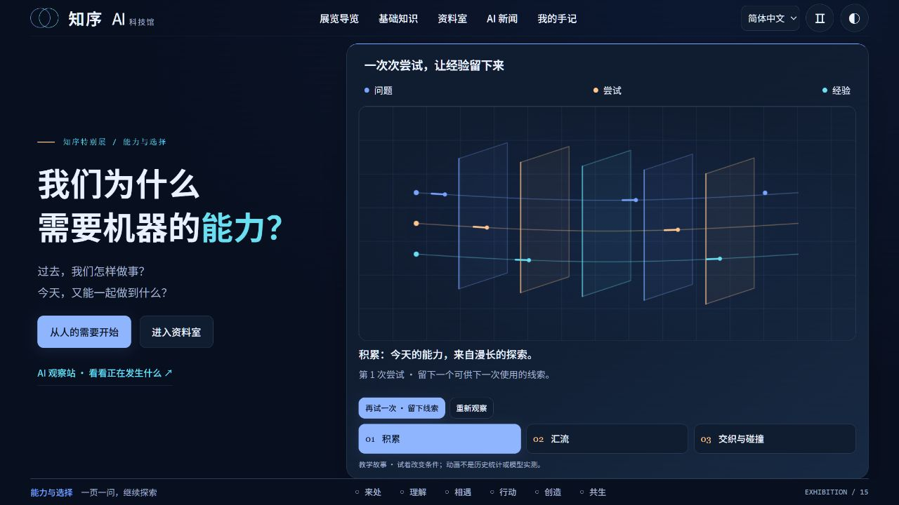
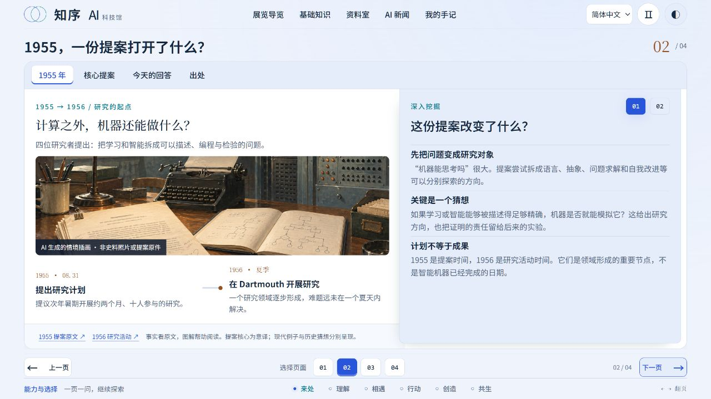

# 知序 AI 科技馆 · 能力与选择

**一座可以阅读、操作和思考的线上 AI 科技馆。由 Codex（GPT-6 Astra）完成设计与开发。**

从“我们为什么需要机器的能力”出发，沿着历史、原理、真实任务与未来生活，理解 AI 怎样工作、哪些事情值得交给它，以及哪些选择仍需要我们自己作出。

**6 幕展览 · 23 个主展页 · 12 个基础概念展柜 · 108 篇中文馆藏 · 8 种语言**

当前版本：**v0.16.0**。

## 在线体验

**[直接进入知序 AI 科技馆 →](https://xialuyu5-oss.github.io/zhixu-ai-museum/)**

无需下载、登录或配置 API Key。支持电脑与手机，首次访问默认简体中文。

[从第一幕开始](https://xialuyu5-oss.github.io/zhixu-ai-museum/#act/1/0) · [基础知识展柜](https://xialuyu5-oss.github.io/zhixu-ai-museum/#basics) · [进入资料室](https://xialuyu5-oss.github.io/zhixu-ai-museum/#library/0/0) · [设计你的助手](https://xialuyu5-oss.github.io/zhixu-ai-museum/#act/5/0)

## 为什么做这座馆

AI 已经进入写作、学习、开发和日常工作。我们接触到的，常常是一个流畅的答案、一段惊艳的演示，或者一个越来越高的成绩。理解它，还需要往下追问：答案怎样产生？证据是否支持结论？工具真的完成了任务吗？

知序把这些问题放进一条可以亲手探索的展线：读一段材料，改变一个条件，观察结果，再判断自己的理解是否需要修正。历史提案、教学图解、可操作实验与来源阅读在这里汇聚，让抽象概念与具体选择联系起来。

展览最后回到人的生活：**当物质不再让我们发愁，精神世界能支撑生活吗？** 这是一项开放的思想实验，关于归属、价值、方向，以及能力更强之后我们希望怎样生活。

## 六幕展线：从能力的来处，到人的选择

| 展厅 | 核心问题 | 可以看到与亲手尝试的内容 |
| --- | --- | --- |
| **[01 来处](https://xialuyu5-oss.github.io/zhixu-ai-museum/#act/1/0)** · 它从哪里来 | AI 时代，我们做事的方式发生了哪些变化？ | 比较会议整理、外语阅读与故障排查；阅读 1955 年研究提案；用零件样本理解学习，再看程序、CUDA 与 GPU 的分工。 |
| **[02 理解](https://xialuyu5-oss.github.io/zhixu-ai-museum/#act/2/0)** · 它怎样回答 | 一句话进入模型之后，发生了什么？ | 拆解 Token，观察参数、量化与上下文的作用，通过微型计算理解注意力如何汇集信息。 |
| **[03 相遇](https://xialuyu5-oss.github.io/zhixu-ai-museum/#act/3/0)** · 哪些事交给它 | 说得流畅，就值得相信吗？最强的模型一定最合适吗？ | 拆开主张、核对依据、修正表达；在教学案例中比较质量门槛、完整成本与控制边界。 |
| **[04 行动](https://xialuyu5-oss.github.io/zhixu-ai-museum/#act/4/0)** · 从回答到行动 | 工具回复“成功”，事情就完成了吗？ | 跟随一项任务看查资料、起草、审批与验收；对照直接 API 与 MCP 的连接方式，区分连接、授权和结果检查。 |
| **[05 创造](https://xialuyu5-oss.github.io/zhixu-ai-museum/#act/5/0)** · 设计你的助手 | 怎样把一个愿望变成可执行、可检查的任务？ | 写目标与完成条件，选择资料，设置权限与执行预算；逐步试运行，观察停止、失败与恢复，导出自己的设计。 |
| **[06 共生](https://xialuyu5-oss.github.io/zhixu-ai-museum/#act/6/0)** · 我们走向哪里 | 当机器能做得更多，人想把什么留给自己？ | 讨论决定权、时间、分配与意义，经过结语回望整条展线，留下自己的问题与手记。 |

主展线采用“一页一问”的阅读节奏。可以顺序参观，也可以通过展览导览、页码和基础知识入口，直接进入自己关心的问题。

## 可以亲手做的实验

每个实验都围绕一个可观察的变化展开，操作之后能看到条件、结果与解释之间的联系。

| 互动内容 | 你可以改变什么 | 值得观察什么 |
| --- | --- | --- |
| **样本与分类边界** | 调整零件的分类阈值，再补入边界附近的训练样本。 | 为什么训练样本全部判断正确，新零件仍可能分错？ |
| **Token 与文本表示** | 输入不同文字，观察教学切分与编号。 | Token 为什么不总是一个汉字或一个完整单词？ |
| **参数与量化** | 改变参数规模和数值表示精度。 | 权重占用的空间怎样变化？为什么体积不能单独代表能力？ |
| **上下文与注意力** | 调整可用材料，观察有限空间和微型注意力计算。 | 资料放进窗口之后，是否就一定能被有效利用？ |
| **并行计算** | 改变教学任务的安排方式与并行条件。 | 哪些工作可以同时进行，哪些仍然需要等待？ |
| **证据与模型选择** | 切换任务、质量门槛与比较条件，重写缺乏依据的结论。 | 哪些内容被证据支持？完成一件事的成本包括什么？ |
| **工具与助手运行** | 选择连接方式，设置读取、保存、审批与验收条件，注入故障。 | 一个任务在哪一步推进、被阻止或安全停止？ |

这些都是便于理解机制的简化教学模型。数字、分类结果和演示表现不构成真实模型排名或生产系统评测。

## 设计一个能说明白的助手

第五幕把前面遇到的概念连成一次完整练习。你可以从技术分享、设备日志、家庭安排或学习助手等情境开始，也可以修改任务目标。

1. **明确工作**：对照模糊与具体的任务说明，写出目标和完成条件。
2. **选择资料**：区分相关证据、无关文字与缺失信息。
3. **约定边界**：设置读取和保存权限、人工审批、执行步数、独立验收与检查点。
4. **逐步运行**：查看当前环节、草稿和运行记录；尝试资料失败、工具假成功、拒绝审批、中断与恢复。
5. **带走设计**：导出 Markdown 设计说明、JSON 运行记录，以及成功运行后生成的教学产物。

这里的助手由浏览器内的规则状态机驱动，不调用真实大模型或外部工具。它把“模型之外还需要什么”展示出来：任务状态、权限、反馈、停止条件，以及对实际结果的检查。

## 资料、实践与来源在这里汇聚

**[资料室](https://xialuyu5-oss.github.io/zhixu-ai-museum/#library/0/0)** 提供“理解模型、使用 AI、设计与实现、工程与部署、继续观察”五条探索路径。每一站把概念实验、馆藏文章与延伸资料连接起来，支持按问题寻找材料。

- **12 个基础概念展柜**：人工智能、学习与训练、Token、参数与量化、上下文、向量表示、知识库与检索、Transformer、算力与 CUDA、Agent、MCP 与 Tools、Harness。
- **108 篇中文馆藏**：覆盖入门概念、应用方法、工具连接、工程实践与运行系统等主题，并保留已有资料的核验日期和来源线索。
- **[AI 新闻观察站](https://xialuyu5-oss.github.io/zhixu-ai-museum/#news)**：按主题和来源筛选消息，从“读消息”走向“找依据”，再返回馆内的相关知识。在线版展示随仓库发布的新闻快照。
- **[我的手记](https://xialuyu5-oss.github.io/zhixu-ai-museum/#notes)**：记录问题与想法，导出 Markdown，或通过 JSON 备份和导入。手记保存在当前浏览器中，不会自动跨设备同步。

## 阅读与视觉体验

展览采用深空蓝、信号青、电光蓝与轨道白，结合插画、动态连线、可操作图表和分层说明。动画用于呈现关系和过程；阅读时也可以暂停动效，或切换深浅主题。

v0.16.0 将整座馆统一为「近未来实验室」：默认深空蓝，浅色阅读采用轨道白；序厅以透明切片和信息流呈现积累与汇流，图表用蓝、青、暖色区分机制与人的选择，结语保留缓慢漂移、边缘渐隐的光束。历史插画保持原有质感。已有访客的主题选择会保留，支持系统减少动态效果设置。详见 [视觉系统](docs/visual-system.md)。

界面与互动教学支持 **简体中文、繁体中文、English、日本語、한국어、Deutsch、Français、Русский**，默认简体中文。简中、繁中、日语与拉丁字母分别配置本地字体，标题与正文采用不同字形层次；页面适配桌面与移动端。

如果是第一次接触 AI，可以从第一幕顺序参观；如果已经在工作中使用 AI，可以先看第三幕的证据与选择；如果正在尝试设计助手，可以直接进入第四、第五幕，再按需要返回基础知识展柜。

## 界面预览

**序厅 · 从人的需要开始**



**主展 · 从历史提案走向今天的问题**



以上两张为当前版本的实际页面截图；顶部封面为 AI 生成的概念配图。图像来源与生成说明见 [配图说明](docs/github-visuals.md)。

## 关于制作

**设计与开发：Codex（GPT-6 Astra）。** 用户提出需求、确定方向并持续评审；Codex（GPT-6 Astra）完成展览页面设计、代码实现、交互实验、多语言接入、验证与迭代。项目在反复的页面体验与反馈中，逐步完善内容、中文表达、布局、字体和动效。

项目以原生 HTML、CSS、JavaScript 构建交互，Python 负责生成离线文件与静态网站，以及可选的本地新闻更新。展览运行无需模型服务或 API 密钥。

## 本地启动

需要 Python 3.10+；普通运行和构建不需要第三方 Python 包。

```sh
python -B server.py --no-update --port 8774
```

浏览器访问 `http://127.0.0.1:8774`。此模式使用仓库中保存的新闻快照。Windows 也可双击 `start-local.cmd`，该入口会启用公开新闻源定时检查。

根目录 `index.html` 是完整离线文件；`deploy/site/` 是静态网站，须整体保留 `archive.html`、`news.json` 与 `assets/`。不要将本地预览服务直接暴露到公网。

## 构建与检查

```sh
python -B build.py
npm test
python -B -m unittest discover -s tests -p "test_*.py" -v
```

Node.js 用于开发检查，访客运行不依赖 Node。字体子集制作是可选维护步骤，另需字体源文件、fonttools 与 brotli。

浏览器验证：在仓库根目录运行 `python -B -m http.server 8786 --bind 127.0.0.1`，打开 `/tests/usability-feedback.html`。各验证页面应依次运行，避免同时临时修改同源存储。

整站主题检查入口为 `/tests/future-theme.html`，覆盖深浅主题、全部主展页与基础概念，以及资料室、新闻和手记。

## GitHub Pages 发布

在线版由 GitHub Pages 托管。主分支的网站相关内容更新后，[发布工作流](.github/workflows/pages.yml) 自动构建、运行现有 Node.js 与 Python 检查，再发布 `deploy/site/`。README 等介绍文档的修改不触发网站重建。

网站使用仓库中已保存的新闻快照。定时抓取模板保留在 [docs/examples/news-and-pages.yml](docs/examples/news-and-pages.yml)，当前未启用定时抓取。

## 文件导航

| 目录 / 文件 | 用途 |
| --- | --- |
| `src/` | 可编辑页面、展品、交互、样式与八语言资源 |
| `assets/` | 插画、本地字体、字体许可与来源清单 |
| `data/` | 新闻快照、来源校正与已有译文 |
| `tools/` | 新闻处理、翻译维护、字体制作和打包工具 |
| `tests/` | 状态机、构建、数据和浏览器验证 |
| `build.py` | 同步生成离线 HTML 与静态网站 |
| `server.py` | 仅监听本机的预览服务 |
| `deploy/site/` | 可托管的静态网站 |

## 内容与使用边界

实验数据为明确标注的教学示例，不是真实模型测评。本地助手试运行使用规则状态机，不调用大模型或真实外部工具。手记与用户输入保留在当前浏览器。

界面和互动教学支持八语言；历史馆藏正文仍为中文。新闻保留来源原文、日期和链接，已有标题/摘要译文随语言显示，未翻译的新消息明确回退原文。部分外语长文仍需要母语编辑校对。

新闻快照和馆藏中的产品信息、价格等带有时间背景，使用前应回到原始来源核验。联网更新须主动运行服务或更新工具；静态网页本身不会抓取外部订阅源。

字体许可和内容来源说明见 [THIRD_PARTY_NOTICES.md](THIRD_PARTY_NOTICES.md)，验证范围见 [docs/validation.md](docs/validation.md)。仓库公开不代表为全部原创内容授予额外的开源再许可；本版本暂未指定原创部分的开源许可证。
